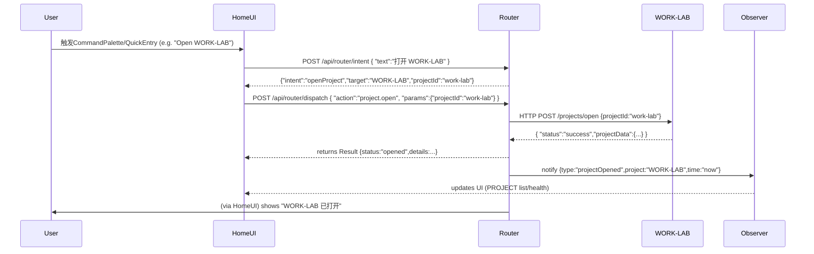

# WORK-LAB 超级入口 / Command Center / LAB Router（2026-09-27 迁入后续任务）

> **状态：OPEN（后续任务，未授权执行）。** 本文由用户 2026-09-27 贴入迁移入库
> （两次贴入内容一致，10334 tokens；以本份为准，不留第二份）。它是**规划/研究层**
> 文档：WORK-LAB 作为系统级超级入口的架构设想（Command Center + LAB Router +
> 各 Adapter），**不是 taskpack，不授予任何执行权限**。落地前须走
> `taskpacks/current/` 的 task-card / registry 流程（参考 P1-C / P1-E 的 GOAL 34
> 先例），且遵守 WORK-LAB 既有铁律：
>
> 1. **本地个人研究使用：禁止加锁 / 访问令牌 / 鉴权入口**（本规划中的
>    JWT/OAuth2/密钥管理等条目与用户铁律冲突，落地时必须改写为无鉴权方案
>    或整体舍弃，不得照搬）。
> 2. **Observer 只读铁律**：Observer/监控面零 批准/拒绝/撤销/重试/回滚 入口。
> 3. **不吞并 ArcheAxis / DESIGN-LAB**：各自领域自治，只经统一协议对接。
> 4. 数据与证据纪律：UNKNOWN 不伪造 0；每层证据分级（本地验证 ≠ CI ≠ 发布）。

---

# 摘要

为了满足“WORK-LAB 作为系统级超级入口”的需求，我们建议将 **Quick Entry、Command Center、Control 面板、Observer 监控面**集成到 **一个 WORK-LAB 产品** 中，以避免再创建第四个独立项目。这一方案符合历史规划：WORK-LAB 原本定位为“跨执行引擎控制平面”，天生具备项目注册、任务调度、Agent 管理等能力。我们将把 **WORK-LAB Command Center** 设计为顶层桌面/快速启动器（支持自然语言命令、全局热键、状态汇总），并结合严格分离的可写 Control 接口与只读 Observer 界面，形成统一的超级入口。ArcheAxis 与 DESIGN-LAB 仍然保持独立业务边界，通过统一的协议与 WORK-LAB 对接，而不是被吞并。这样，WORK-LAB 即成为 **整套系统的超级入口与执行大脑**，而 ArcheAxis 负责“知识/学习/证据”，DESIGN-LAB 负责“专业设计”，各司其职。

下面的报告将深入技术细节：第一部分为整体架构，包括组件、数据模型、API/协议（Capability/Intent/Action/Context 等）；第二部分为整合方案，对比 PowerToys、Raycast、Flow、RemNote、n8n 等开源工具的复用方案和风险；第三部分详细设计 LAB Router（注册、意图解析、上下文调度、权限、状态聚合）并附示例流程图；第四部分列出各项 Adapter 接口模板（含 ArcheAxis、WORK-LAB、DESIGN-LAB、Codex、DSH、Hermes、Figma、ComfyUI、本地模型等示例 JSON 载荷与认证方式）；第五部分讨论安全隔离策略（独立进程、权限沙箱、审计跟踪）；第六部分给出部署和基础设施建议（桌面平台、后端服务、消息总线、数据库、CI/CD、监控）；第七部分规划里程碑路线（P0–P3）及人力时间估算；第八部分提供 LLM 提示词模板；第九部分给出对比表和落地检查表作为产品交付内容。

---

## 1. 架构概览

### 1.1 核心组件

最终系统包括以下核心组件：

- **WORK-LAB Command Center（超级入口）**：集成 **Home/Quick Entry/Control/Observer** 四大界面。可通过快捷键或菜单呼出（模态输入框或迷你窗口），输入自然语言命令或查询，显示全局状态、项目列表和任务健康等。可调用 LAB Router 处理 Intent 并分派给对应项目或模型。
- **LAB Router 服务**：位于后端，负责 **Capability 注册、Intent 解析/路由、Context 管理、权限校验、状态汇总**。各应用（ArcheAxis、WORK-LAB、DESIGN-LAB、未来 LAB）在初始化时向 Router 注册自己支持的能力（Capability）和入口命令（Intent）。Router 接收用户命令后，执行解析后调用对应的 Action（例如“打开项目”“执行任务”），并跨服务转发请求。
- **ArcheAxis**：作为知识与学习平台，提供**知识查询、学习/复习**等功能。维护 Evidence、知识库、历史决策、学习进度等。Router 可调用 ArcheAxis 提供的“Knowledge”、“Evidence”等 API，以获取上下文或沉淀结果。
- **WORK-LAB 执行平面**：负责任务拆解、Agent 调度、模型/工具运行。提供“Task/Workflow/Agent/Runtime”等 API，可执行、暂停、查询任务等。是实际执行链的中枢。
- **DESIGN-LAB 设计域**：提供**设计工作台**，包括设计需求管理、Design Token 生成、设计工具集成（Figma、Photoshop、Blender、ComfyUI 等）。Router 可打开 DESIGN-LAB 启动专业创作任务。
- **Planner Providers**：多种 LLM 及低成本模型的接入点，如 ChatGPT/Claude/Gemini 等。负责**规划与审计**任务。Router 将用户的高层目标发给 Planner 获得执行方案，再交给 WORK-LAB。
- **Runtime Providers**：执行层使用的引擎，如 Codex、DSH、Hermes 或本地模型（GPT系列、DeepSeek、Qwen、LLaMA家族等）。这些提供计算和任务执行能力。

```mermaid
flowchart LR
  subgraph WORK-LAB Command Center
    Home[/Home/Quick Entry/Launcher/Status/Notifications/Apps/Approvals/Recent/Projects/Agents/Edges/Ask/CommandInput/Intent/Goal/Status\n(快捷启动、全局搜索、状态概览)\]
    Control(Projects / Tasks / Workflows / Agents / Runtimes / Tools / Approvals / Policies / Budgets / Config)
    Observer(SysHealth: CPU/GPU/Cost/Latency / Agents / Tasks / Errors / Receipts)
  end
  subgraph LAB Router
    Registry[Capability & Intent Registry]
    IntentResolver
    ContextBroker
    PermissionBroker
    StatusAggregator
  end
  subgraph ArcheAxis ["ArcheAxis (知识/学习)"]
    KnowledgeDB[(Knowledge DB)]
    Learning[Human/AI Learning]
    Evidence[(Evidence)]
  end
  subgraph WORK-LAB ["WORK-LAB (执行)"]
    TaskExec
    AgentSpawner
    Tools
    Approval
    Workflows
  end
  subgraph DESIGN-LAB ["DESIGN-LAB (设计)"]
    Projects
    Assets[(Design Assets)]
    Tools_DL
    Workbench["Design Workbench UI"]
  end
  subgraph Providers
    Codex[Codex/GPT APIs]
    DSH[DSH/DeepSeek]
    Hermes[Hermes Agents]
    Models["Local & Cloud Models (Gemini/Claude/etc)"]
    FigmaAPI
    ComfyUIAPI
  end

  Home --> |Intent/Command| LAB Router
  LAB Router --> ArcheAxis
  LAB Router --> WORK-LAB
  LAB Router --> DESIGN-LAB
  WORK-LAB --> Providers
  DESIGN-LAB --> Providers
  ArcheAxis --> LAB Router
  LAB Router --> Control
  Control --> TaskExec
  Control --> AgentSpawner
  Control --> Approval
  Observer --> StatusAggregator
  LAB Router --> Observer
```

### 1.2 数据模型与协议

#### 核心数据模型

- **Capability**：每个系统支持的动作能力，如 `project.open`、`task.run`、`design.create` 等。用于意图路由。
- **Intent**：用户的自然语言或结构化命令目标，如“继续 DESIGN-LAB 项目”，“运行下一步任务”等。Router 解析后映射到具体 Action。
- **Action**：对应业务操作，比如 `openProject(projectId)`、`runTask(taskId)`、`launchAgent(args)` 等。由 Router 调度后端服务执行。
- **Context**：当前项目/任务的上下文信息，如项目 ID、用户角色、近期历史、权限范围等。由 Context Broker 管理和传递。
- **Result/EvidenceRef**：执行后的结果、输出、证据等引用，用于后续审计和 ArcheAxis 的知识沉淀。
- **Permission**：用户或 Agent 对资源的访问权限，确保关键操作需要审批或多签等。
- **Approval**：待审批记录，当高敏感/高成本操作需人工同意时生成审批单。
- **Resource**：可执行对象，如 Project、Task、Model、Tool、Asset 等。
- **Runtime**：可用的执行环境，如 Codex/GPT API、DSH 节点、Hermes 实例、本地 GPU 等。
- **Health/Status**：系统或任务状态监控指标，供 Observer 显示。

#### API/协议示例

我们采用 REST+WebSocket 双向通信：Router 提供 HTTP 接口供前端调用和外部系统推送事件，必要时支持 WebSocket 推送事件（如任务进度更新、审批提醒等）。

- **Capability 注册（POST）**
  - Endpoint: `POST /api/registry/register`
  - Payload: `{ "application": "ArcheAxis", "capabilities": ["knowledge.search", "learning.review", ...] }`
- **Intent 解析与路由（POST）**
  - Endpoint: `POST /api/router/intent`
  - Payload:
    ```json
    {
      "userId": "u123",
      "text": "继续 DESIGN-LAB 当前项目",
      "context": {"activeProject": "design-proj-42"}
    }
    ```
  - 返回示例:
    ```json
    {
      "intent": "continueProject",
      "target": "DESIGN-LAB",
      "action": "project.open",
      "parameters": {"projectId": "design-proj-42"},
      "requiresApproval": false
    }
    ```
- **Open/Action Dispatch (POST)**
  - Endpoint: `POST /api/router/dispatch`
  - Payload: `{ "action": "project.open", "params": {"projectId":"x"}, "origin": "HomeUI" }`
  - 该请求由 Router 转发至对应后端（ArcheAxis/WL/DL），后端返回执行结果或后续步骤。
- **Context Broker (WebSocket)**
  - Channel: `/ws/context`，订阅后可收到上下文切换通知，如 `{projectId:"y",activeTask:"t1"}`。
- **Status/Observer (WebSocket or SSE)**
  - Channel: `/ws/status`，推送系统/任务健康数据，如 CPU、Token 消耗、Agent 状态更新等。

示例流程：用户在 Quick Entry 输入“审计 ArcheAxis”，发出 Intent 请求，Router 解析为 `{action: "audit", target:"ArcheAxis", ...}`，调用 WORK-LAB 的相应 API；执行完成后，把审计结果封装为 EvidenceRef 回传给 ArcheAxis，并在 Observer 页面更新状态。

详细协议文档和 API 需进一步定义，示例如上。

---

## 2. 集成方案

为避免重复造轮子，我们评估了多种现有开源产品/框架，并将它们应用于不同层面：

| 工具/框架 | 功能位置 | 可复用内容 | 需改造 | 风险/许可 | 预估工期 |
|---|---|---|---|---|---|
| **PowerToys CmdPal** | **桌面快速启动器（P0 快速原型）** | - Windows 原生快捷键调用、Dock、热键 (Win+Alt+Space)。<br>- 扩展API via WinRT/COM（.NET）<br>- 支持列表页、Markdown页、Fallback命令、Pin等界面元素。 | - 只能在 Windows 环境下使用。<br>- 扩展模式需 .NET/COM 实现，团队需熟悉 WinRT。<br>- 功能相对受限，可能需要集中在一小块区域展示。 | ✅ 免费开源；许可证 MIT。<br>❗ Windows限定；2026年仍Preview版，API可能改动。 | **P0**：1-2人周快速验证。实用后P1后将迁移到自主Router。 |
| **Raycast Windows** | **桌面启动器（可快速验证P0/P1）** | - 跨平台JS/TS扩展框架，丰富UI组件。<br>- 支持 AI Chat、Snippet、QuickLinks、多语言和模型接入（OpenAI/Ollama）等高级功能。<br>- 完整社区和商店生态（数千扩展可参考）。 | - Raycast本身闭源，仅扩展开放；需学习React+TypeScript。<br>- Windows版仍处于公测；高级AI功能（本地模型、私人API）多数Pro付费。<br>- 不适合作为最终产品代码基础（更适合用户/短期团队）。 | ✅ 免费个人版（非Pro功能可能受限）；使用者需同意服务条款。 | **P0/P1**：3-4人周实验，多人可并行；若用则开发者需熟悉WebStack。 |
| **Flow Launcher** | **桌面启动器（开源方案）** | - 纯开源(.NET MIT)，支持C#、Python等插件开发。<br>- 类似Everything的搜索、Web搜索、Shell命令、书签等。<br>- 完整插件市场和CLI(`pm`)管理（支持 Python/C#）。 | - UI风格较简朴；定制UI空间有限。<br>- AI功能需自行通过脚本插件调用（已有示例）。<br>- 最终想自研完整Shell时需替换。 | ✅ 完全免费、MIT许可；社区活跃。 | **P0**：1-2人周集成测试。<br>**P1**：2周适配模板命令。 |
| **RemNote** | **知识库 & 人工学习** | - 内置MCP Server（可让Claude/Codex直接查询笔记）。<br>- 学习卡片、记忆图谱、计划复习系统。<br>- 支持 Markdown 笔记与资源管理、书签等。 | - 主要用于“人学习”侧，需要融入ArcheAxis目标体系；<br>- 现有RemNote功能较专注个人知识管理，需评估再造或数据迁移。<br>- 不做为超入口，但其MCP模式值得借鉴。 | ✅ 免费个人版（部分高级功能Pro）。许可证混合（部分 MIT 代码）。 | **P1**：2-3人周研究利用场景（主要思想借鉴）。可选择集成RemNote作为ArcheAxis知识库原型。 |
| **Obsidian** | **知识库** | - 强大的笔记RAG系统。<br>- 支持社区插件（MCP、AI、图谱等）。<br>- DeepLink (obsidian://)。 | - 主要个人笔记定位；与ArcheAxis专业学习系统重合度低。 | ✅ 基础免费，付费Sync/Publish。插件多MIT授权。 | **P2**：1人周评估文档存储和链接。 |
| **Dify** | **任务/工作流** | - 开源AI工作流编辑器（Node.js），支持模型链路、插件节点。<br>- 类似WORK-LAB的工作流构建思路（图形编排）。 | - 功能针对API搭建，不适合做最终超入口。<br>- 可作为灵感：具备节点、触发器、流程视图等。 | ✅ 开源（适用MIT）。 | **P2**：1-2人周研究其对Workflow的启发。 |
| **Open WebUI** | **本地模型集成** | - 本地部署界面，支持GPT4All、Koala等模型。<br>- 提供插件函数系统（纯Python，可执行Python代码）。 | - 安全隔离复杂性高（执行任意代码需严格限制）。<br>- 主要Focus视觉UI，非任务Orchestration。 | ✅ 免费开源（部分依赖Apache/MIT等）。 | **P3**：概念参考，建议不直接嵌入。 |
| **n8n** | **流程/集成自动化** | - 开源低代码工作流（Node.js）平台，可调用Webhooks/HTTP/API/DB等。<br>- 强大事件触发和条件判断节点系统。 | - 偏向后台流程自动化，与我们设计不同；<br>- 可借鉴其“可视化流程管理”理念。 | ✅ 开源（Apache 2.0）。 | **P2**：调研学习流程编排模式。 |
| **VSCode Extension Host** | **扩展模型** | - 多进程隔离扩展环境。<br>- API 调用限制，IPC 通讯。<br>- 丰富安全沙箱设计。 | - VSCode 本身庞大，不直接复用，但扩展宿主思想可参考。 | ✅ MIT（部分）。 | **参考**：学习其安全模型。 |

在**快速原型阶段 (P0-P1)**，我们首选**PowerToys Command Palette**或**Flow Launcher**等现有“启动器”宿主，重点验证交互和路由逻辑：
- **PowerToys CmdPal**：官方支持扩展，可快速使用 Win+Alt+Space 框架；适合 Windows 环境，适合核心团队熟悉 Windows 平台。
- **Flow Launcher**：开源插件灵活度高，适合快速试验各种命令与AI插件，用 Python 脚本快速验证方案。
- **Raycast**：若团队偏好 Web/Node/TypeScript 栈，可使用 Raycast Windows 版本做高保真原型；但注意未来许可问题和Windows兼容性。

在**长期方案 (P2+)**，应**自研 LAB Router 与协议**，并仅利用上述工具作为“皮肤”或实验宿主。例如：**Quick Entry**（输入框、全局菜单）可在 Flow Launcher/PowerToys 上实现原型，后续可移植到独立 Tauri 客户端；**项目切换/状态板**可在 PowerToys 锚点或 Flow 插件界面中简单展示，后续用 React 重构；**扩展**部分则基于 MCP/Launch protocol 进行自定义开发。

**关键复用点**：
- **快捷唤起 & 界面**：PowerToys/CmdPal 和 Flow 各自提供“全局快捷键+UI”框架，我们可以利用它们的 “Fallback 命令” 或脚本插件功能，调起自研的路由接口并显示结果。
- **扩展机制**：CmdPal 提供 WinRT + COM 扩展；Flow 提供脚本插件（C#, Python）接口；Raycast 提供 Node/React API。可根据团队语言熟悉度分别选择适合平台开发。
- **知识侧**：RemNote 的 MCP 接入方式表明我们可为 ArcheAxis 提供 MCP 接口，让 Claude/GPT 等直接检索。也可参考 Obsidian URI、Notion Search 之类的 DeepLink 方案，实现外部快速跳转和内容调用。
- **执行侧**：工作流和 Agent 编排方面，借鉴了 Dify 和 n8n 的视图工具思路，但工作由 WORK-LAB 和 Hermes/Codex 实现；OpenWebUI 的工具调用模式暗示我们应严格沙箱执行，不让扩展执行任意代码。

**风险与注意**：
- 利用第三方“启动器”只能作为**辅助入口**，最核心的协议和逻辑应自研，避免被“框架所限”或未来不可控的版本变更。
- 跨平台需求“未指定”，本文暂假定 Windows 为首要目标。
- 安全隔离须严格，例如 CmdPal Extension 独立进程加载能力有限；Flow Launcher 脚本插件可以执行 arbitrary code，需要做好输入校验和权限控制。
- 许可：PowerToys (MIT)、Flow (MIT)、Raycast 扩展免费但闭源商业产品，RemNote 部分功能免费可用。引用时注明协议，避免版权问题。

---

## 3. LAB Router 设计

### 3.1 总览

**LAB Router** 是超级入口的“大脑”，负责调度与融合。其核心子模块包括：
- **Capability Registry**：存储所有 LAB 应用和 Provider 向系统声明的**能力列表**和匹配命令。例如 WORK-LAB 注册 `task.run`, DESIGN-LAB 注册 `design.create`, ArcheAxis 注册 `knowledge.search`。
- **Intent Resolver**：将用户输入的自然语言或快捷命令解析成结构化Intent，如 `{action:runTask, targetProject:"DESIGN-LAB", params:{...}}`。可以使用关键词匹配、NLP 模型或简单规则。
- **Action Router**：根据Intent 将请求转发给相应子系统（通过HTTP/WebSocket接口）。同时处理多步场景：如“审核任务”可能需要先Plan再Notify。
- **Context Broker**：维护当前活跃上下文（项目、用户、会话数据等），在转发请求时附带相关Context。例如执行任务时附加项目ID、依赖数据。
- **Permission Broker**：检查请求是否需要审批，对高权限操作（如删除项目、调用高成本模型）生成审批单，并在获得许可后才执行。
- **Status Aggregator**：收集各系统（WORK-LAB、ArcheAxis、DESIGN-LAB）和资源（模型、Agents）的实时状态，用于 Observer 和统一监控。

```mermaid
flowchart LR
  subgraph LAB Router
    Registry[Capability Registry]
    IntentRes[Intent Resolver]
    ContextBro[Context Broker]
    PermBro[Permission Broker]
    StatusAgg[Status Aggregator]
  end
  HomeCmd[Quick/Command Entry\n用户输入命令]
  StatusUI[Observer Dashboard]
  Feedback[Approvals/Feedback to user]

  HomeCmd -->|输入Intent| IntentRes
  IntentRes -->|查能力| Registry
  IntentRes -->|生成Action| Action[Execute Action]
  Action -->|查权限| PermBro
  PermBro -->|通过或阻塞| Action
  Action -->|调用API| {ArcheAxis/WL/DL}
  {ArcheAxis/WL/DL} -->|返回结果| StatusAgg
  StatusAgg --> StatusUI
  PermBro --> Feedback
  Feedback --> HomeCmd
  ContextBro --> IntentRes
  ContextBro --> Action
  HomeCmd --> ContextBro
```

### 3.2 关键流程示例

#### 流程1：快速入口 → 路由开项目

用户通过快速启动输入“打开 WORK-LAB”或自然语言命令。

在这个流程中，Router 将用户命令解析为 `project.open`，调用 WORK-LAB 后端服务打开项目，然后通知 Observer 更新状态。整个过程对用户来说是无缝的系统跳转。

#### 流程2：Planner Provider → WORK-LAB 执行 → Observer → 回流 ArcheAxis

用户输入“给Design-LAB当前需求生成设计方案”并确认。
```mermaid
sequenceDiagram
    participant User
    participant WorkLabHome as HomeUI
    participant Router
    participant Planner as ChatGPT
    participant WLService as WORK-LAB
    participant CodexService as Codex
    participant Observer
    participant ArcheAxis

    User->>WorkLabHome: “帮我规划 Design-LAB 项目下一步任务”
    WorkLabHome->>Router: POST /api/router/intent {text:"规划 Design-LAB 项目下一步"}
    Router-->>WorkLabHome: {"intent":"planWorkflow","target":"WORK-LAB","projectId":"design-proj-42"}
    WorkLabHome->>Router: POST /api/router/dispatch {action:"workflow.plan",params:{"projectId":"design-proj-42"}}
    Router->>Planner: 调用 "planning" 接口 {goal:"优化Design-LAB设计界面", context:...}
    Planner-->>Router: 返回 structuredPlan { tasks: [...] }
    Router->>WLService: HTTP POST /workflows/create {plan:structuredPlan}
    WLService-->>Router: {"workflowId":"wf-99","status":"started"}
    Router->>Observer: 更新 {"workflowStarted":"wf-99"}
    Router->>User: 通知 "工作流已启动"
    Note right of WLService: 工作者Codex/DSH并行执行任务
    WLService->>CodexService: POST /code/execute {task:"Generate React UI Code"}
    CodexService-->>WLService: codeResult{...}
    WLService->>Observer: 更新任务执行状态
    ...
    WLService->>Observer: 完成, 收集 Logs/Receipt
    WLService->>ArcheAxis: POST /api/archeaxis/evidence { evidence:"设计了新的UI原型", time:..., files:[...] }
    ArcheAxis-->>WLService: {"stored":true}
    Observer-->>WorkLabHome: 更新 "任务完成"
    Router->>User: "设计方案已生成并提交"
```
在该流程中，Planner（例如 ChatGPT 或 Claude）通过 Router 得到上下文后返回可执行计划；WORK-LAB 则调用 Codex/DSH 等Runtime执行各步骤；执行结果和证据在完成后报告给 ArcheAxis 以用于知识沉淀。Observer 实时更新任务状态与系统资源监控。

---

## 4. Adapter 接口定义

### 4.1 通用交互格式

所有 Adapter 都采用JSON格式通信，并支持基于JWT/OAuth的认证。每条请求带有 `traceId` 便于全链路日志跟踪。

#### 示例 JSON 载荷

```json
{
  "traceId": "abc-123",
  "userId": "user-42",
  "timestamp": "2026-09-27T12:34:56Z",
  "action": "design.create",
  "params": { "projectId": "proj-7", "assetType": "logo", "description": "Create a new logo" },
  "context": { "role": "designer", "locale": "zh-CN" }
}
```
权限敏感的 Adapter 操作需额外传递 `permissions` 字段，或通过 API 验证用户角色。

### 4.2 ArcheAxis Adapter

- **路径**：`/api/archeaxis/...`
- **功能**：提供知识查询、学习任务和证据记录接口。
- **示例接口**：
  - `POST /api/archeaxis/knowledge/search`：全文搜索知识库，参数 `{query, projectId}`。
  - `POST /api/archeaxis/learning/review`：获取用户/主题的复习计划。
  - `POST /api/archeaxis/evidence/save`：提交执行结果证据，参数 `{projectId, evidence, files, author}`。
- **返回格式**：标准JSON，包含 `success`、`data`。
- **认证**：使用项目密钥或 JWT token。举例：GraphQL风格可选。

### 4.3 WORK-LAB Adapter

- **路径**：`/api/worklab/...`
- **功能**：管理任务、工作流和Agent调度。
- **示例接口**：
  - `POST /api/worklab/tasks/create`：创建新任务 `{projectId, taskSpec}`，返回 `{taskId}`。
  - `POST /api/worklab/tasks/start`：启动任务 `{taskId}`。
  - `GET /api/worklab/tasks/status?taskId=...`：查询任务状态。
  - `POST /api/worklab/agents/spawn`：启动Agent `{agentType, config}`。
- **参数与示例**：
  ```json
  {
    "action":"run",
    "taskType":"AuditCodeQuality",
    "params":{"projectId":"projX","targetFile":"AuthController.cs"}
  }
  ```
- **认证**：OAuth2 客户端凭证或API Key。必要时审批机制联动。

### 4.4 DESIGN-LAB Adapter

- **路径**：`/api/designlab/...`
- **功能**：设计项目管理、资产管理、设计Token、交付预览等。
- **示例接口**：
  - `POST /api/designlab/projects/create`：创建设计项目。
  - `POST /api/designlab/assets/upload`：上传资产。
  - `POST /api/designlab/design/run`：执行设计任务（如生成Token）。
- **调用示例**：
  ```json
  {
    "action":"design",
    "params":{"projectId":"design1","template":"landingPage"}
  }
  ```
- **认证**：同WORK-LAB，可共享认证服务。

### 4.5 运行时与第三方适配器

- **Codex/DSH/Hermes**：这类作为后端Microservices，Router直接调用它们的公开API（可REST/HTTP或内部SDK）。需提前注册其能力（例如Codex支持`code.execute`）。
- **Figma**：可调用 Figma API（HTTP），Adapter负责 OAuth2 认证并转发命令（如创建/导出设计）。例如：`GET /api/figma/projects`、`POST /api/figma/assets`。
- **ComfyUI (Stable Diffusion)**：Adapter 提供接入 ComfyUI 的接口，如 `POST /api/comfyui/generateImage {prompt, style}`，内部转HTTP到本地 ComfyUI 服务。
- **本地模型 (OpenRouter/Ollama)**：视同 Planner Provider，如 `/api/planner/chatgpt`, `/api/planner/local-llama`。前端可通过 Adapter 调用本地模型服务（Restful、MCP等），确保封装API。

### 4.6 示例认证模式

- **JWT/OAuth2**：WORK-LAB 为主认证服务器，每个 Adapter 注册为 OAuth 客户端。用户登录后由 WORK-LAB 颁发短期 Token，各系统根据 Token 验证权限。
- **MCP Token**：与 Model Context Protocol 类似，ArcheAxis、DESIGN-LAB 各自签发一次性访问令牌给 Planner（Claude/Desktop），确保AI访问受控。
- **审计日志**：所有敏感API调用需记录审计日志，包括 `userId`, `action`, `params`, `timestamp`。方便后续追溯。

---

## 5. 安全与隔离

- **进程隔离**：控制面板(UI)与 Observer 在同一个桌面App，但任何调用外部命令或插件的功能都运行在**独立进程**中。例如：与 Codex 通讯的微服务、与 Figma API 的集成服务，都不在前端主进程内。PowerToys 和 Raycast 的扩展本身就运行在单独进程；我们可借鉴这种模式将不同 Adapter 作为外部服务调度。
- **权限沙箱**：严格区分**只读**和**读写**权限。Observer 界面绝对不持有修改权限，只能调用 GET/SSE 接口获取监控数据；Control 界面则可以调用 POST 操作，但敏感动作需经审批。前端不存储密钥，所有敏感 API 调用都经过 WORK-LAB Backend 的权限检查。
- **扩展主机模型**：类似 VSCode Extension Host，将扩展放在受控容器中。例如 Figma/ComfyUI Adapter 可运行在单独容器，限制网络访问，仅允许调用目标API。
- **加固本地AI**：对于 Planner 使用 ChatGPT Web，应避免“浏览器自动化抓Token”不稳定方案；推荐使用官方API或桌面App。一旦支持 MCP，Agents 也仅能使用被授权的DATA。
- **密钥管理**：使用 Vault (如HashiCorp Vault)等集中存储API密钥/凭证，并在服务启动时注入环境变量。审计和轮换密钥策略严格执行。
- **日志与审计**：对所有路由、Adapter 请求、权限变更、审批活动进行不可篡改日志记录。敏感操作（如“调用深度模型”“读取私人文件”）需审批链可查询。

---

## 6. 部署与基础设施

- **桌面端**：建议使用 **Tauri + React** 构建 WORK-LAB Command Center。Tauri 可打包成跨平台桌面应用（主要为 Windows，但可考虑 macOS/Linux）。React/UI 推荐 Ant Design 或 Tailwind，统一风格。Quick Entry 可使用 Tauri 模态窗口或系统托盘快捷键响应。
- **后端服务**：**Node.js/Express or Fastify** 作为 LAB Router 服务，部署在本地服务器或云主机（根据规模选用）。各 Adapter 可作为微服务（REST API）或 Node.js 模块。Runtime（Codex/DSH/Hermes）通常是独立的容器化服务。
- **消息总线**：使用 **MQTT 或 Redis Pub/Sub** 实现事件广播（如任务状态更新推送Observer）。或使用现成Pub/Sub服务（如NATS、Kafka）视团队熟悉度。
- **数据库**：轻量的 **PostgreSQL** 或 **SQLite/Dexie** 作为持久层，用于存储项目上下文、任务记录、Evidence 元数据等。ArcheAxis 知识库可使用专用图DB（如 Neo4j）或文档DB（MongoDB）来管理知识图谱。
- **身份认证**：集中式 **OAuth2 + JWT** 服务，WORK-LAB 提供登录与Token颁发，所有请求携带JWT。Linux 服务可用Keycloak等，也可自行用Express中间件实现。
- **CI/CD & 监控**：使用 **GitHub Actions** 或 **GitLab CI** 持续集成，自动构建 Tauri App 和后端镜像。使用 **Prometheus + Grafana** 监控指标（CPU/GPU/内存/请求延迟/队列长度等），并报警。日志推送到 **Elastic Stack** 实现搜索与审计。
- **成本考虑**：尽量优先开源技术和免费模型。模型托管可自建GPU服务器（成本高）或租用API（需估算调用量）。P0阶段可用免费配额，本地GPU测试。务必评估云服务费用，限制高成本模型调用（如大型LLM可设置白名单模式）。

---

## 7. 路线与里程碑

- **P0 (验证阶段)**：周期 **1个月**。
  - **目标**：验证“超级入口”可行性。
  - **活动**：在 PowerToys CmdPal 或 Flow Launcher 上实现**Quick Entry**扩展；实现简单 *Router Adapter* (本地REST服务)；跳转 ArcheAxis/WORK/Design 模拟页面。测试简单Intent解码和路由。
  - **交付**：简单 Demo（PowerToys/FLOW插件 + 本地Router），评估可用性。
  - **人力**：2 人月。
- **P1 (构建阶段)**：周期 **2-3 个月**。
  - **目标**：开发核心协议和基础系统。
  - **活动**：
    - 自研 **LAB Router** 服务（Capability/Intent/Action/Context核心API）。
    - 实现 **WORK-LAB Control API** 简版（任务创建、启动、状态）。
    - 实现 **ArcheAxis Adapter**（知识查询/Evidence记录）和 **DESIGN-LAB Adapter**（设计任务调度）。
    - 完善 **WORK-LAB Command Center** 前端（Home/Control/Observer）。React + Tauri 开发UI。
    - 集成至少 **一种 Planner Provider** (如OpenAI API)和 **一种 Execution Provider** (如Codex)。
    - 编写用户、技术文档、接口文档。
  - **交付**：可实际运行的 alpha 版系统，提供端到端例子（如设计任务闭环）。
  - **人力**：6-8 人月。
- **P2 (功能完善)**：周期 **3-4 个月**。
  - **目标**：多 Provider 集成，扩展能力。
  - **活动**：
    - 集成更多模型（Claude/Gemini、本地Llama 等）作为 Planner/Runtime。
    - 增加 **MCP 支持**，使外部AI能够访问 ArcheAxis/工作流数据。
    - 开发更多 Adapter（Figma、ComfyUI）。
    - 优化 UI/UX，完善多语言支持。
    - 整合 **n8n/Dify** 风格的可视化工作流编辑（选做）。
  - **交付**：功能完善beta版，支持更多用例。
  - **人力**：8-10 人月。
- **P3 (安全与扩展)**：周期 **3个月**。
  - **目标**：安全加固，性能优化，扩展未来模块。
  - **活动**：
    - 完善**权限审批系统**、细粒度审计。
    - 强化**沙箱隔离**、容器化部署。
    - 性能调优（缓存、并发处理、负载均衡）。
    - 开始规划**Game-LAB/Video-LAB**接入。
    - 完成**文档与培训**。
  - **交付**：可商业化的稳定版系统。
  - **人力**：10-12 人月。

**备注**：上述里程碑基于“未指定”团队规模与环境，假设小型敏捷团队(5-8人)。具体时间视需求优先级和团队资源调整。

---

## 8. LLM 提示词模板

### 8.1 规划者 (Planner)

```
You are an intelligent AI planner. Given a project description and current context, generate a structured plan of tasks.
例子:
Goal: "设计一个新的品牌Logo"
Context: {"project":"Design-LAB","phase":"logo-sketch","constraints":["use company colors","vector format"]}
Tasks should be in JSON:
[
  {"step":1,"action":"Research Competitors","description":"Study competitor logos in our industry."},
  {"step":2,"action":"Generate Concepts","description":"Use design tool to create 5 logo concepts"},
  ...
]
Use concise Chinese descriptions.
```

### 8.2 审计员 (Auditor)

```
You are an AI code/design auditor. Review the task at hand and suggest improvements.
Example:
Code to review: [provided code snippet].
Instructions: Identify potential bugs or style issues, and provide a summary in Chinese. If none found, reply "No issues".
```

### 8.3 Adapter 代码生成器

```
You are an AI code assistant. Generate adapter code for integrating an external API.
Specifically, create an Express.js endpoint for Figma:
POST /api/figma/projects/open
Payload: { "fileKey": "xxx", "nodeId": "yyy" }
It should call the Figma REST API with proper OAuth token and return JSON of the design data.
Include error handling. Write code in JavaScript (Node/Express).
```

这些模板可根据具体任务微调，保持提问上下文清晰、结构化。

---

## 9. 交付清单

### 9.1 选型对比表

| 方案 | 平台支持 | 开放性 | UI 灵活度 | AI 集成 | 许可 | 备注 |
|---|---|---|---|---|---|---|
| **PowerToys CmdPal** | Windows | 中 (扩展仅 .NET) | 中等 | 支持 ChatGPT (Win 桌面) | MIT | 官方级，开发环境限定，易验证 |
| **Raycast** | Win/macOS | 低 (闭源) | 高 (React/TS) | 强 (AI 插件丰富) | 未知 (商业) | 体验优异，不适长期定制 |
| **Flow Launcher** | Windows | 高 (MIT) | 低(简单UI) | 需自接 (脚本插件) | MIT | 社区成熟，灵活度高 |
| **自研 Desktop** | Win/macOS/Linux | 最高 | 最自由 | 按需实现 | 自己决定 | 投入最大，但定制度最高 |

### 9.2 实施检查表

- [ ] **Quick Entry 基础**：Alt+Space 唤起框，支持输入意图文本（CmdPal/Flow Extension）。
- [ ] **LAB Router 服务**：启动并监听Intent请求，初步解析关键词（如“打开”→`project.open`）。
- [ ] **能力注册**：ArcheAxis/WORK/Design应用注册Capability列表，Router加载。
- [ ] **项目切换**：实现 Router->WorkLabDispatch->Observer->UI 的全流程。
- [ ] **任务执行**：WORK-LAB 可创建并启动伪任务；Observer 实时显示进度。
- [ ] **知识查询**：ArcheAxis Adapter 可接收搜索请求并返回示例结果。
- [ ] **设计调起**：能从入口打开 DESIGN-LAB 工具或面板。
- [ ] **权限审批**：模拟高危操作生成审批单（可手动过审）。
- [ ] **Planner 接入**：通过 API Key 连接一个LLM，实现简单规划。
- [ ] **Evidence 收集**：任务完成后将结果报告给 ArcheAxis。
- [ ] **安全测试**：确认Observer页面只能只读；Control页面功能需校验权限。

以上检查点可确保关键功能得到验证。

---

最终，我们选择 **把 WORK-LAB 打造成超级入口**，而不是单纯编写一个新 Launcher。WORK-LAB 已经具有跨系统调度和权限治理能力，通过**集成界面+严密协议**来承载超级入口。ArcheAxis 和 DESIGN-LAB 保持专业领域自治，协同构成完整生态。通过上述架构设计、开源整合和路线规划，相信在可预见的范围内能够稳步实现目标。
